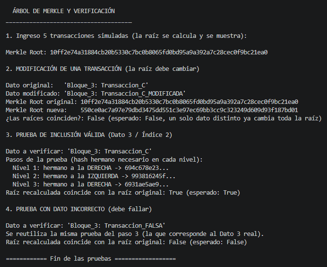

# Laboratorio 2 — Árbol de Merkle

## ¿De qué se trata?

Implementación de un Árbol de Merkle, usado en blockchain para verificar si un dato pertenece a un conjunto sin revisar todo el conjunto. Se le saca SHA-256 a cada transacción, se combinan de a pares subiendo nivel por nivel, hasta llegar a un solo hash: la **raíz (Merkle Root)**. Si una transacción cambia, la raíz cambia por completo (efecto avalancha).

## Decisiones de diseño

- **cada nivel es una lista de strings (hashes)**, y la relación padre-hijo se deduce por posición.
- **Reconstrucción desde cero:** no se guarda el árbol en memoria; cada vez que se pide la raíz o una prueba, se reconstruye con la lista de transacciones actual.
- **Caso impar:** si un nivel queda con cantidad impar de hashes, se duplica el último para que tenga pareja.

## Cómo correrlo

```bash
python main.py
```

Solo usa `hashlib` (incluida en Python, no requiere instalar nada).

## Qué hace el experimento

1. Crea 5 transacciones y muestra la Merkle Root.
2. Modifica una transacción y muestra que la raíz cambia (efecto avalancha).
3. Genera la prueba de inclusión de la transacción 3 y la verifica (`True`).
4. Intenta verificar un dato falso con esa misma prueba, y falla como se espera (`False`).

## Capturas de pantalla



## Diagrama del árbol construido

Con las 5 transacciones del experimento, el árbol queda con 4 niveles: 5 hojas → 3 → 2 → 1 (la raíz). Como en el Nivel 0 y en el Nivel 1 quedan cantidades impares de hashes (5 y 3), el último elemento de cada uno se duplica para poder emparejarlo.

Para que se lea fácil, cada hash se identifica con una etiqueta corta en vez del hash completo (la tabla de abajo dice el hash real de cada etiqueta):

```
RAÍZ  =  hash(H1234 + H5555)
│
├── H1234  =  hash(H12 + H34)
│   │
│   ├── H12  =  hash(H1 + H2)
│   │   ├── H1  =  SHA256(TX_1)
│   │   └── H2  =  SHA256(TX_2)
│   │
│   └── H34  =  hash(H3 + H4)
│       ├── H3  =  SHA256(TX_3)
│       └── H4  =  SHA256(TX_4)
│
└── H5555  =  hash(H55 + H55)      ← Nivel 1 quedó impar (3), se duplicó H55
    │
    └── H55  =  hash(H5 + H5')
        ├── H5   =  SHA256(TX_5)
        └── H5'  =  copia de H5      ← Nivel 0 quedó impar (5), se duplicó H5
```

**Hashes reales de tu ejecución (primeros 10 caracteres):**

| Etiqueta | Hash (truncado) | Nivel |
|---|---|---|
| `H1` | `e62614dc5e...` | 0 (hoja) |
| `H2` | `460d7af1cf...` | 0 (hoja) |
| `H3` | `f46d4b82b7...` | 0 (hoja) |
| `H4` | `694c678e23...` | 0 (hoja) |
| `H5` / `H5'` | `b3d3bf55ca...` | 0 (hoja, duplicado) |
| `H12` | `993816245f...` | 1 |
| `H34` | `2ce597c9c9...` | 1 |
| `H55` | `933613abc2...` | 1 |
| `H1234` | `64f204cad5...` | 2 |
| `H5555` | `6931ae5ae9...` | 2 |
| **RAÍZ** | `10ff2e74a3...` | 3 |
